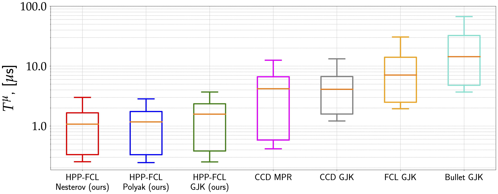
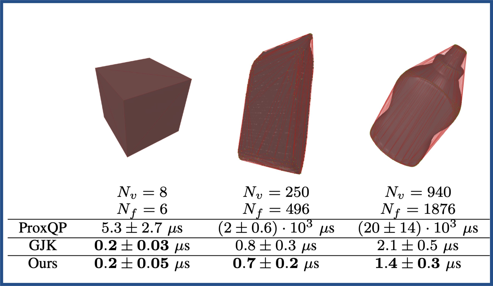

# HPP-FCL — An extension of the Flexible Collision Library

  
  
  
  
  
  
  
  

[FCL](https://github.com/flexible-collision-library/fcl) was forked in 2015. Since then, a large part of the code has been rewritten or removed (for the unused and untested part).
The broad phase was reintroduced by J. Carpentier in 2022 based on the FCL version 0.7.0.

## New features

Compared to the original [FCL](https://github.com/flexible-collision-library/fcl) library, the main new features are:
- a dedicated and efficient implementation of the GJK algorithm (we do not rely anymore on [libccd](https://github.com/danfis/libccd))
- the support of safety margins for collision detection
- an accelerated version of collision detection *à la Nesterov*, which leads to increased performances (up to a factor of 2). More details are available in this [paper](https://hal.archives-ouvertes.fr/hal-03662157/)
- the computation of a lower bound of the distance between two objects when collision checking is performed, and no collision is found
- the implementation of Python bindings for easy code prototyping
- the support of height fields, capsule shapes, etc.
- the fix of various bugs

This project is now used in many robotics frameworks such as [Pinocchio](https://github.com/stack-of-tasks/pinocchio), an open-source software that implements efficient and versatile rigid body dynamics algorithms and the [Humanoid Path Planner](https://humanoid-path-planner.github.io/hpp-doc), an open-source software for Motion and Manipulation Planning.

## A high-performance library

Unlike the original FCL library, HPP-FCL implements the well-established [GJK algorithm](https://en.wikipedia.org/wiki/Gilbert%E2%80%93Johnson%E2%80%93Keerthi_distance_algorithm) and [its variants](https://hal.archives-ouvertes.fr/hal-03662157/) for collision detection and distance computation. These implementations lead to state-of-the-art performances, as depicted by the figures below.

On the one hand, we have benchmarked HPP-FCL against major software alternatives of the state of the art:
1. the [Bullet simulator](https://github.com/bulletphysics/bullet3),
2. the original [FCL library](https://github.com/flexible-collision-library/fcl) (used in the [Drake framework]()),
3. the [libccd library](https://github.com/danfis/libccd) (used in [MuJoCo](http://mujoco.org/)).

The results are depicted in the following figure, which notably shows that the accelerated variants of GJK largely outperform by a large margin (from 5x up to 15x times faster).

  

On the other hand, why do we care about dedicated collision detection solvers like GJK for the narrow phase? Why can't we simply formulate the collision detection problem as a quadratic problem and call an off-the-shelf optimization solver like [ProxQP](https://github.com/Simple-Robotics/proxsuite))? Here is why.

  

One can observe that GJK-based approaches largely outperform solutions based on classic optimization solvers (e.g., QP solver like [ProxQP](https://github.com/Simple-Robotics/proxsuite)), notably for large geometries composed of tens or hundreds of vertices.

## Acknowledgments

The development of **HPP-FCL** is actively supported by the [Gepetto team](http://projects.laas.fr/gepetto/) [@LAAS-CNRS](http://www.laas.fr), the [Willow team](https://www.di.ens.fr/willow/) [@INRIA](http://www.inria.fr) and, to some extend, [Eureka Robotics](https://eurekarobotics.com/).
